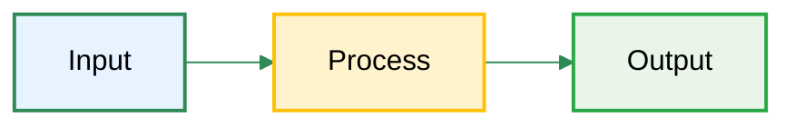
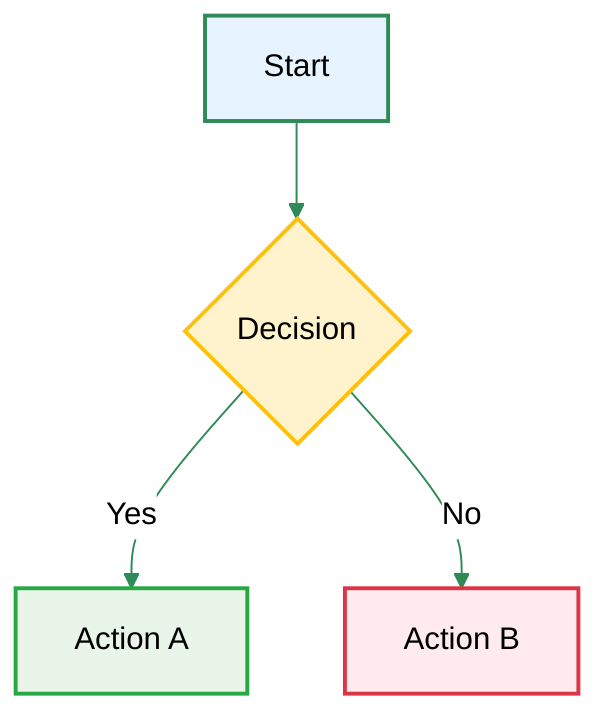
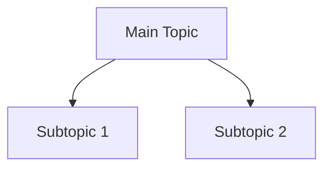
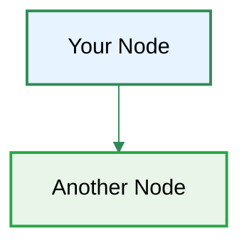

# Mermaid Styling Guidelines

## Standard Theme Configuration

Use this init block for all Mermaid diagrams to ensure consistent, readable styling:

```
%%{init: {'theme':'base', 'themeVariables': { 'primaryColor':'#ffffff', 'primaryTextColor':'#000000', 'primaryBorderColor':'#2e8b57', 'lineColor':'#2e8b57', 'secondaryColor':'#e7f3ff', 'tertiaryColor':'#f8f9fa'}}}%%
```

## Color Palette

### Background Colors (Light with good contrast)
- **Primary Light**: `#e7f3ff` (light blue)
- **Success Light**: `#e8f5e8` (light green)  
- **Warning Light**: `#fff3cd` (light yellow)
- **Danger Light**: `#ffebee` (light red)
- **Info Light**: `#e7f3ff` (light blue)
- **White**: `#ffffff` (white)

### Accent Colors (For emphasis)
- **Primary**: `#2e8b57` (dark green)
- **Success**: `#28a745` (green)
- **Warning**: `#ffc107` (yellow)
- **Danger**: `#dc3545` (red)
- **Info**: `#007bff` (blue)

### Border Colors
- **Primary Border**: `#2e8b57`
- **Success Border**: `#28a745`
- **Warning Border**: `#ffc107`
- **Danger Border**: `#dc3545`

## Standard Style Patterns

### For Important Central Nodes
```
style NodeName fill:#2e8b57,stroke:#1f5f3f,stroke-width:3px,color:#fff
```

### For Regular Nodes (Light Background)
```
style NodeName fill:#e7f3ff,stroke:#2e8b57,stroke-width:2px,color:#000
```

### For Success/Positive Nodes
```
style NodeName fill:#e8f5e8,stroke:#28a745,stroke-width:2px,color:#000
```

### For Warning/Caution Nodes
```
style NodeName fill:#fff3cd,stroke:#ffc107,stroke-width:2px,color:#000
```

### For Error/Negative Nodes
```
style NodeName fill:#ffebee,stroke:#dc3545,stroke-width:2px,color:#000
```

### For Emphasis/Action Nodes (Dark Background)
```
style NodeName fill:#28a745,stroke:#28a745,stroke-width:2px,color:#fff
```

## Example Usage

### Basic Flowchart


### Decision Tree


## Text Contrast Rules

- **Light backgrounds**: Always use `color:#000` (black text)
- **Dark backgrounds**: Always use `color:#fff` (white text)
- **Minimum contrast ratio**: 4.5:1 for accessibility

## Common Issues and Fixes

### Issue: Black boxes or invisible text
**Fix**: Use light background colors with dark text:
```
style Node fill:#ffffff,stroke:#2e8b57,stroke-width:2px,color:#000
```

### Issue: Poor contrast
**Fix**: Test combinations at https://webaim.org/resources/contrastchecker/

### Issue: Mindmaps not rendering
**Fix**: Use regular graph instead:


## Accessibility Guidelines

1. **Color alone should not convey meaning**
2. **Use patterns or text in addition to color**
3. **Ensure 4.5:1 contrast ratio minimum**
4. **Test with colorblind simulators**

## Template for New Diagrams



Copy this template and modify as needed for consistent, readable diagrams.